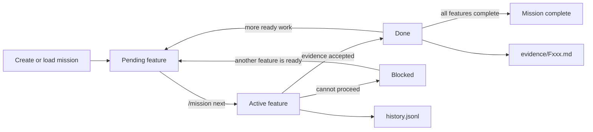

<div align="center">


# @groeponline/pi-missions

**Durable execution tracks for Pi coding agents.**

Keep a multi-step job alive across restarts, compaction, forks and handoffs without reconstructing the plan from chat history.

[](https://www.npmjs.com/package/@groeponline/pi-missions) [](https://www.npmjs.com/package/@groeponline/pi-missions) [](https://github.com/GroepOnline/pi-missions/actions/workflows/ci.yml) [](https://pi.dev/packages/@groeponline/pi-missions) 

</div>

## Why Pi Missions

Agent sessions are temporary. Real implementation work is not.

Pi Missions gives a job a durable identity with a plan, ordered features, acceptance criteria, evidence, history and handoff state. The active session can end; the mission remains on disk and can be loaded again by Pi or another compatible worker.

Use it when a task is too large for one prompt, one context window or one uninterrupted coding session.

## Where it fits

Pi Missions owns **durable work state**: plans, features, evidence, history, recovery, and handoff context that must survive session boundaries. It does not replace Wishcraft's lightweight idea inbox and it does not execute multi-agent swarms itself.

`pi-wishcraft idea -> pi-missions mission -> pi-agent-orchestrator run` is the intended promotion path when a thought becomes durable work and then needs parallel or isolated execution.

- [`pi-wishcraft`](https://github.com/GroepOnline/pi-wishcraft): operator cockpit and fast idea capture.
- **pi-missions**: durable plan/task/evidence state.
- [`pi-agent-orchestrator`](https://github.com/GroepOnline/pi-agent-orchestrator): execution fabric for agents, worktrees, swarms, schedules, and handoffs.

GitHub, Slack and webhook integration classes remain lightweight scaffolding; production-readiness is tracked in [#13](https://github.com/GroepOnline/pi-missions/issues/13).

## 30-second start

```bash
pi install npm:@groeponline/pi-missions
```

Inside Pi:

```text
/mission start "Implement user auth"
/mission status
/mission next
# work on the active feature
/mission done "Tests pass and login flow verified"
```

Resume later:

```text
/mission list
/mission load <mission-id>
/mission status
```

## Execution loop



The agent is expected to work only on the active feature. Completion is explicit: `/mission done` or `mission_feature_done` records evidence before the queue advances.

## What persists

By default missions live under `~/.pi/missions`. `MISSIONS_ROOT` takes precedence over `PI_MISSIONS_ROOT` when you need a shared or custom absolute path.

```text
~/.pi/missions/
├── <mission-id>/
│   ├── plan.json              # current mission state and feature queue
│   ├── plan.json.bak          # recovery copy
│   ├── history.jsonl          # append-only transition/event history
│   ├── evidence/
│   │   └── Fxxx.md            # completion evidence per feature
│   └── sessions/              # session attachment / handoff metadata
└── database/
    └── pi-missions.db         # SQLite analytics/repository data
```

The file-backed mission state is the resumable runtime record. SQLite is a structured repository/analytics layer; it does not replace the per-mission `plan.json`, history and evidence files.

## Mission Control

`/mission dashboard` renders the terminal dashboard for the active mission. `/mission status` gives the compact progress view, while `/mission metrics`, `/mission history` and `/mission debug` expose deeper runtime information.


## Core capabilities

| Capability | What it does |
| --- | --- |
| Durable state | Persists mission plan, active pointer, history, evidence and session metadata locally. |
| Ordered work | Tracks `pending`, `active`, `blocked` and `done` features with dependencies and acceptance criteria. |
| Evidence-first completion | Saves explicit proof when a feature is marked complete. |
| Crash-safe writes | Uses backup/atomic state writes and file locking around mission mutation. |
| Handoffs | Reload the same mission in a later Pi session without rebuilding the plan. |
| Workers | Spawn and inspect a separate Pi worker for the active feature. |
| Recovery | Retry recorded errors, inspect debug state and migrate older mission schemas. |
| Templates | Scaffold common mission shapes such as bug fixes, refactors, docs and security audits. |
| Metrics | Records mission/session metrics and exposes dashboard/history views. |

## Slash commands

| Command | Purpose |
| --- | --- |
| `/mission new <title>` / `/mission start <title>` | Create a mission. |
| `/mission list` | List saved missions. |
| `/mission load <id>` | Attach an existing mission to the current session. |
| `/mission status` | Show progress, active feature and acceptance criteria. |
| `/mission next` | Activate the next ready feature. |
| `/mission done [evidence]` | Complete the active feature and persist evidence. |
| `/mission block <reason>` | Block the active feature with a reason. |
| `/mission run` / `/mission autopilot` | Run mission automation. |
| `/mission pause` / `/mission resume` / `/mission stop` | Control mission execution. |
| `/mission clear` | Detach the mission from the current session. |
| `/mission edit <feature-id>` | Edit feature state/criteria. |
| `/mission fork <reason>` | Create a linked alternative track from the active feature. |
| `/mission dashboard` | Open Mission Control. |
| `/mission metrics` | Show mission/session metrics. |
| `/mission history [filter]` | Inspect mission history. |
| `/mission debug` | Inspect recent runtime/debug information. |
| `/mission export [filename]` | Export a Markdown mission report. |
| `/mission templates ...` | List or scaffold built-in templates. |
| `/mission worker` | Spawn a worker for the active feature. |
| `/mission worker-status` | Inspect the active worker. |
| `/mission kill-worker` | Stop a worker. |
| `/mission migrate ...` | Inspect or migrate older mission state. |

## Agent tools

Pi Missions also exposes mission-native tools so an agent can advance work without pretending a feature is complete:

- `mission_feature_done`
- `mission_next_feature`
- `mission_ask_user`
- `mission_block_self`
- `mission_fork`
- `mission_error_status`
- `mission_retry_error`
- `mission_spawn_worker`
- `mission_worker_status`
- `mission_kill_worker`

## Architecture

```text
src/
├── core/        # state, transitions, migrations, extension lifecycle
├── commands/    # /mission command handlers
├── tools/       # agent-facing mission tools
├── engines/     # autopilot, completion, recovery, metrics, workers
├── database/    # SQLite schema and repository layer
├── templates/   # built-in mission templates
├── ui/          # terminal dashboard and UI helpers
├── utils/       # filesystem, context, markdown, logging helpers
└── cli/         # pi-missions CLI
```

GitHub, Slack and webhook integration classes are still lightweight scaffolding. They are not advertised as production integrations.

## Requirements

- Node.js `>=22.5.0` for the built-in `node:sqlite` driver.
- Pi packages compatible with the peer dependencies declared in `package.json`.
- Optional: install `better-sqlite3` in the host project to use it instead of `node:sqlite`.

## Local development

```bash
npm ci
npm run check
npm test
npm run build
npm run smoke:ci
npm run verify:package
```

Run the built extension locally:

```bash
pi -e ./dist/index.js
```

### Recovery behavior

Safe mission saves keep the previous valid `plan.json` as `plan.json.bak`. When the primary plan is unreadable or invalid, loading automatically tries the backup before giving up. Schema migrations create a separate timestamped `plan.json.pre-migration-*.bak` before rewriting state. Recovery is automatic for a corrupt primary plan; operators can inspect the backup files directly when diagnosing a failed migration or filesystem problem.

CLI diagnostics:

```bash
node dist/cli/index.js doctor
```

## Releases

User-visible changes are tracked in [CHANGELOG.md](./CHANGELOG.md). GitHub Releases are generated from the matching changelog section and link the exact npm version.

The release helper also derives fallback notes from commit subjects when `[Unreleased]` is empty, so an automated publish cannot silently create another blank release entry.

## License

MIT © GroepOnline
